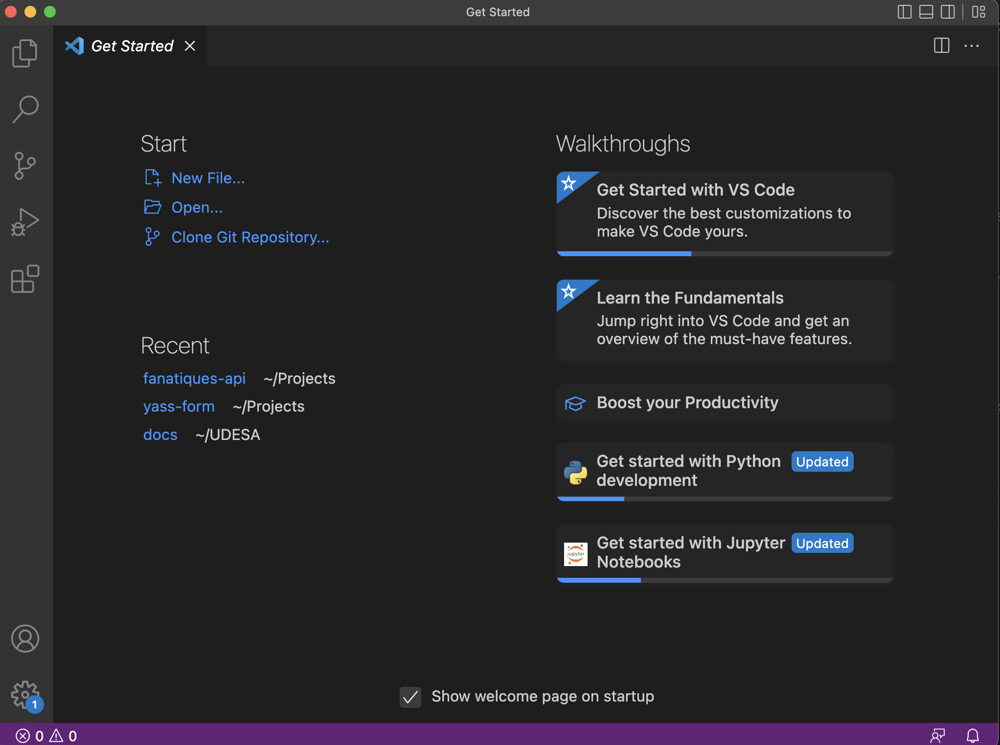
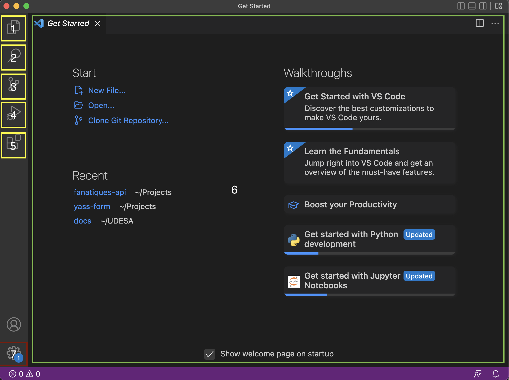

# Pensamiento Computacional

Benvenidos a la documentación oficial de la catedra para la instalación y correcto setup de su entorno de desarrollo!

## Primeros Pasos
Por favor, primero deben ver la guía acorde a su sistema operativo para instalar Python.
La guía se encuentra disponible para MacOS y Windows. En caso de estar utilizando un sistema Linux, recomendamos ver la sección 
de isntalación de Python de la guía para windows dado que la misma utiliza WSL para simular un entorno Linux.

* [MacOS](installation/mac-install.md)
* [Windows](installation/windows-install.md)

## Entorno de desarrollo:
Luego de instalar correctamente el entorno de Python que utilizaremos, vamos a seguir por el setup del entorno de desarrollo
utilizando VS Code. En el último paso de la guía anterior, instalamos dicho programa y vimos que es un simple editor de texto
(una versión con esteroides de notepad para los que tiene Windows)

Durante toda la cursada vamos a ver muchas de las propiedades y ventajas que tiene este editor, pero por el momento intentemos
tener un entorno de desarrollo mínimo que nos permita hacer un `Hello World`.

!!! note

    En programación, se acostumbra escribir un programa que muestre por pantalla la frase `Hello World` cuando recién arrancamos con
    un lenguaje nuevo. Es una tradción arbitraria que no tiene mucho sentido más que poder ver la funcionalidad básica del lenguaje y 
    su sintaxis.

### Primera vista:
Si abrimos el programa, seguramente encontremos una primera pantalla muy parecida a la siguiente:

Es importante destacar las secciones del editor:

La sección resaltada en verde (pantalla principal), es donde se vizualizarán los docuemntos abiertos. Cuando abirmos el programa,
no tenemos ningún documento abierto por lo que dicha sección muestra un mensaje de bienvenida.

Luego tenemos la columna derecha con sus iconos resaltados en amarillo. Esta sección es la que contiene las distintas funcionalidades
del editor y vamos a ir analizando cada una más en detalle más adelante.

Finalmente, tenemos la esquina inferior izquierda que representa la parte de configuración. Si encesitamos hacer cambios en la tipografía, los *hot-keys* o demás, se hace desde esta sección.

