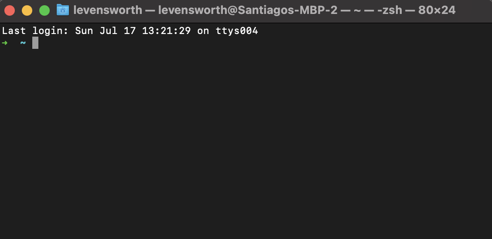

# Windows Python Installation
Esta sección es una guía para generar un entorno de desarrollo necesario para el curso de pensamiento computacional
el cual constará de los siguientes recursos:

- `WSL 2` Como interfaz con el sistema operativo
- `Pyenv` como manejador de versiones de Python
- `VS Code` como editor de texto

Al finalizar esta guía contaremos con un editor de texto y el interprete de Python correspondiente para esta materia.
Utilizaremos Python en su versión `3.8.13` por lo que es importante seguir estos pasos para hacer un correcto setup.

!!! warning

    Todo el material aquí presente solo es válido para sistema operativo Windows 10 o superior

!!! info

        En este tutorial hablaremos de la *Terminal*, esto es un programa especial que viene incluído dentro de nuestra computadora y 
        se utiliza para interactuar con nuestro sistema operativo. Antes que existieran las Graphical User Interfaces, la gente 
        utilizaba
        estas terminales de texto para utilizar la computadora. 
        Siempre que escuchemos **CLI**, tenemos que recordar que esto se refiere al termino Command Line Interface. Lo cual hace 
        referencia 
        a aquella época en la que la gente se comunicaba con la computadora utilizando la terminal. Entonces si un programa debe tener 
        una *CLI* o debemos utilizar la *CLI* de un programa, simplemente nos estan diciendo que debemos ejecutar el programa o 
        comando desde una terminal.

        Windows por defacto utiliza lo que se llama *command prompt* esto **NO** es lo que queremos utilizar, veremos que al finalizar 
        la primer sección tendremos una terminal que se parece a la siguiente:

        

        Lo primero que veremos es una flecha la cual nos indica donde está el *cursor* (donde estamos escribiendo). Dentro de esta 
        pequeña terminal, solo funciona el teclado así que no intenten hacer click con el mouse para moverse. 

## 1. WSL 2: Windows Subsystem for Linux.

Históricamente Windows no es comúnmente utilizado como sistema operativo para aprender en cursos y carreras de informática
esto se debe a variedad de razones que abarcan desde tener un diseño que hace un poco más complicado armar entornos de desarrollo
para herramientas que no sean Microsoft hasta el hecho de que no es un sistema operativo de código abierto.
Por estas y otras razones, es que los cursos y carreras informáticas normalmente se dictan basados sobre la premisa de correr software
que corra sobre sistemas de código abierto como las distribuciones de LINUX. Aunque desde nuestro lugar **recomendamos fuertemente que
todos tengan una forma de correr un sistema operativo basado sobre UNIX** como puede ser MacOS, Ubuntu, Arch, Raspbian, etc. Esto no 
es un impedimento para la materia en cuestión y vamos a ver como podemos generar un entorno que nos permita aprender sin tener mayores 
inconvenientes.

!!! warning

    
    Si bien este tutorial es válido para poder tener uns distribución de todo el entorno de desarrollo que necesitamos para 
    Pensamiento 
    Computacional. Es recomendable que generen una partición del disco con un sistema operativo basado en Linux como puede ser Ubuntu, 
    otra opción sería utilizar un programa como virtualBox para generar una máquina virtual que corra el entorno que nos interesa.

Lo primero que haremos es abrir una Command Prompt o **adminstrator PowerShell** y corremos el siguiente commando:

        wsl --install

Esto nos guiará por la serie de pasos para descargar el sistema operativo Ubuntu dentro de nuestra computadora. 
Finalizada la decarga, debemos pasar a hacer un setup de un usuario dentro de este nuevo sistema operativo.

[Guía de setup ubuntu](https://docs.microsoft.com/en-us/windows/wsl/setup/environment#set-up-your-linux-username-and-password)

Finalizado tood este proceso, nos encontramos con un nuevo sistema operativo basado en la arquitectura UNIX que vive dentro de nuestra
computadora Windows! Es importante que cada vez que hablemos de la `terminal` nos referiremos a esta nueva terminal que representa el
sistema operativo Ubuntu.

## 2. PyEnv: Python Version management.
!!! info "Un poco de contexto:"
        A esta altura, te estarás preguntando "como puede ser tan difícil tener lo necesario para programar? me están queriendo 
        hackear la 
        computadora?". Todas estas preguntas son completamente válidas y entendibles para quien no está acostumbrado a lidiar con los 
        problemas
        de programar.
        La realidad es que todos los pasos que seguimos hasta ahora no son específicos para Python, sino que descargamos herramientas 
        necesarias para cualquier tipo de programación que hagan y les serán útiles en el resto de la carrera! Si pensamos en una 
        analogía de 
        cocina, donde programar es cocinar. Lo que acabamos de hacer es *comprar* los utencilios de cocina, que son necesarios para 
        cocinar.

        Ahora, Python es un lenguaje y como todo lenguaje (español, chino, java,  javascript, sql, etc) no necesita más que te 
        acuerdes de la
        sintaxis para poder escribirlo. Es decir, no importa el lenguaje (sea de programación o no) lo único que necesitamos para 
        saberlo es 
        entender su sintaxis. Habiendo hecho esta aclaración, ahora si podemos concentrarnos en la particularidad de los lenguajes de 
        programación .... y es que las computadoras los entienden y nos permiten comunicarnos con ellas. Esta particular propiedad de 
        los 
        lenguajes de programación no ocurre por arte de mágia sino que se debe a la existencia de *traductores* (programas que 
        traducen los 
        comandos escritos en lenguajes de programación que conocemos a código binario). Estos traductores son específicos para cada 
        computadora y para cada lenguaje (es decir que Python tiene un traductor, C tiene otro, Java tiene otro, etc) por lo que 
        debemos 
        descargar el interprete correspondiente para poder finalmente comunicarnos con nuestra computadora. 

Ahora si, con el contexto de los lenguajes de programación y como estos se comunican con la computadora pasemos a descargar e instalar 
el *traductor* de Python. Para esto vamos a utilizar un paquete especial llamado `pyenv`, este es un programa especial que nos instala 
todo lo necesario para correr el *traductor* de python. La razón de porque utilizamos `pyenv` y no descargamos directamente Python es 
porque el lenguaje tiene muchas versiones. Pensemos en version del lenguaje como ediciones del diccionario español de la RAE. Todos los 
años la RAE revisa el leguanje español y determina que palabras se eliminan y cuales se incorporan como parte del lenguaje. Python 
cuenta con la Python Software Fundation que se encarga de revisar el lenguaje y van modificando cosas del mismo. A diferencia del 
español, un traductor de una versión de Python no sabe de las otras versiones por lo que hay ciertos comandos que son específicos de 
cada versión y es importante tener una forma de manejar las diferentes versiones de Python. `PyEnv` es un manejador de versiones de 
Python, el cual se encarga de menejar la versión de Python por nosotros y por eso es conveniente su uso.

Para instalarlo seguiremos los siguientes pasos:

1. Abrir una terminal

2. Ejecutar el siguiente comando en la terminal:

        sudo apt update && sudo apt upgrade
Seguir los pasos que indique en pantalla, puede ser que tarde un tiempo prolongaod este paso.

3. Cerrar y volver a abrir la terminal

4. Ejecutar el siguiente comando:
        apt install -y make build-essential libssl-dev zlib1g-dev libbz2-dev libreadline-dev libsqlite3-dev wget curl llvm libncurses5-devlibncursesw5-dev xz-utils tk-dev libffi-dev liblzma-dev python-openssl git

Nuevamente, debemos confirmar que queremos instalar todos estos paquetes y esperar.

5. Ejecutar el siguiente comando en terminal
        curl https://pyenv.run | bash

5. Ejecutar el siguiente comando para instalar la versión `3.8.13` de Python

        pyenv install 3.8.13

5. Ejecutar el siguiente comando para dejar esta versión como la default:

        pyenv global 3.8.13
De esta manera cada vez que invoquemos a Python utilizaremos la versión correcta.

6. Podemos probrar que python que todo quedó correctamente instalado ejecutando

        pyenv global
lo cual debería decirnos:

        $>3.8.13

7. Hacer un update de las depencencias, desde terminal:
        
        pip install pip --upgrade
        pip install pipenv

8. Con todo esto, ya se encuentran con su primera versión de Python instalada y lista! Pueden ejecutar el código para
ver la filosófía de Python:
       
        python -c "import this"

## 4. VS Code: Entorno de desarrollo.
Ahora que contamos con un *traductor* de python ya casi somos programadores, solo nos falta:

- Ver la saga completa de Star Wars
- Ropa hipster
- Un sillón gamer 
- Comentar en toda discusión de Twitter sobre que lenguaje de programación es el mejor y porque es Python

Pero dejando todos los estereotipos de lado, nos falta un detalle para poder comenzar nuestra carrera de programación
y es un **editor de texto**. Tal como comenté más arriba, no hay nada especial sobre las palabras que componen un lenguaje de 
programación por lo que nos podriamos preguntar "porque no escribirlo directamente en Word?". Esta pregunta es completamente válida
y la respuesta involucra entender un poco sobre **formatos** de archivos.

Si utilizamos Word o Excel veremos que el archivo que genera el editor tiene una "extensión" del tipo `.doc` o `.xsls` entre otras. 
Esta terminación es una forma que tienen los editores de avisarle al usuario (nosotros) que el archivo está escrito en un formato específico. Si
intentamos abrir dicho archivo sin el editor correspondiente, veremos un montón de símbolos raros y no entendermos nada de lo que esté 
escrito porque se encuentra en formato *binario*. Para programar, en cambio, utilizamos lo que se llama *texto plano* que refiere a 
que no utilizamos ningun editor especial para escribir dicho código. 
Como por defautl MacOS no cuenta con editores de texto plano (TextEdit tiene la funcionalidad pero no es sencillo) utilizaremos un 
editor nuevo que es altamente utilizado y versátil llamado "VS Code".

Para instalarlo debemos seguir los pasos descritos en la sección de instalación dentro del manual de Microsoft =>
[Tutorial de instalación](https://docs.microsoft.com/en-us/windows/wsl/tutorials/wsl-vscode)

