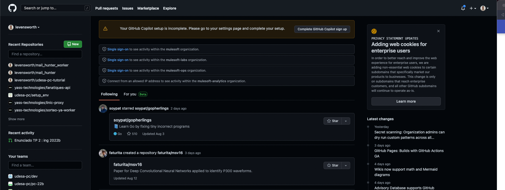
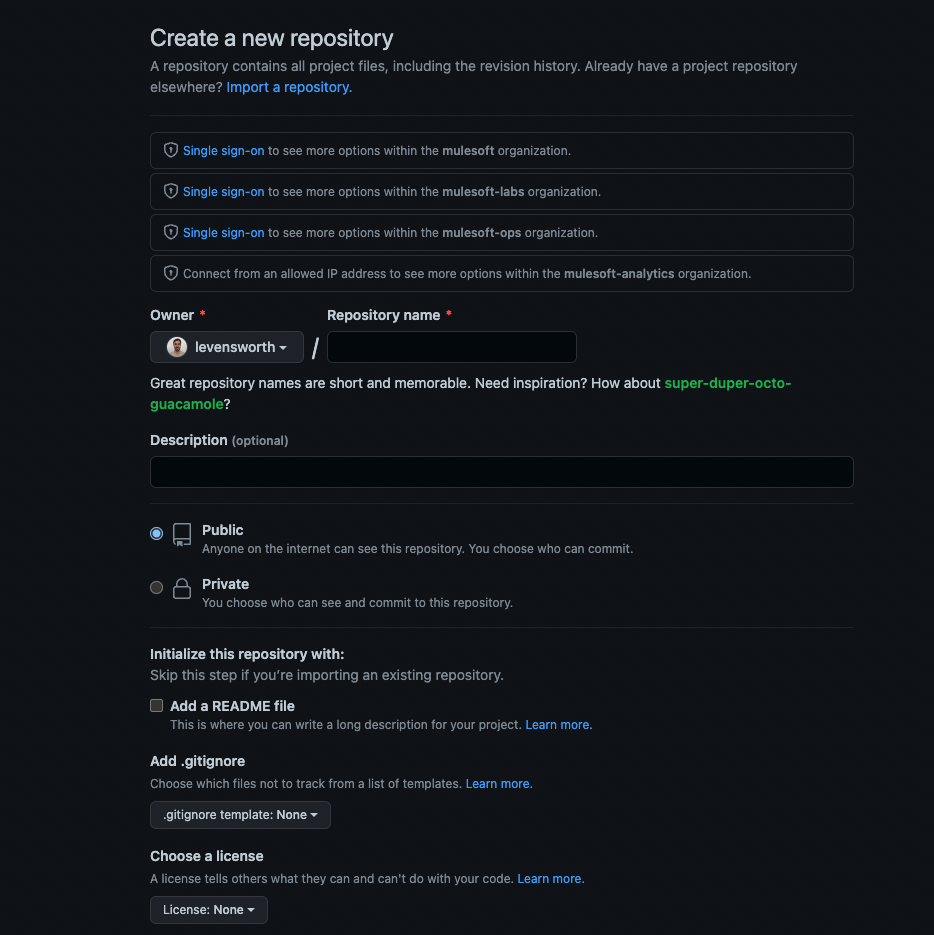
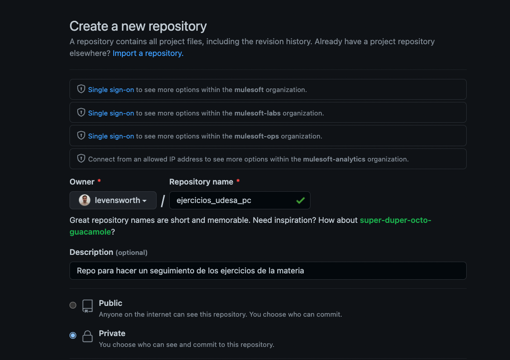
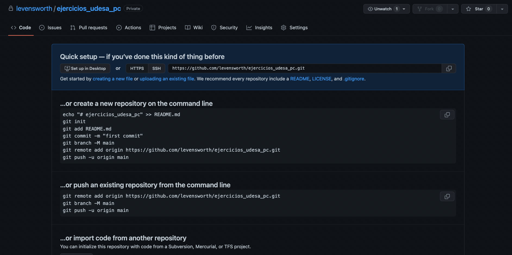
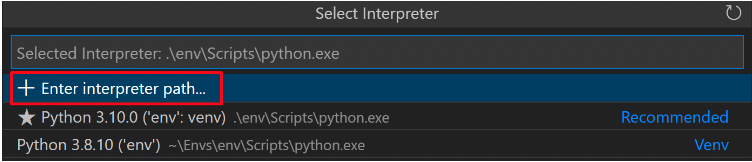
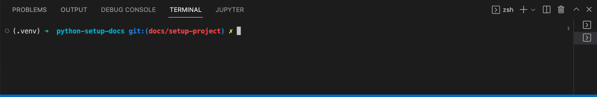

# Nuevo projecto:
En la materia veremos muchos trabajos prácticos, guías y ejercicios que podemos hacer. 
Pero antes de comenzar con este camino, es razonable cuestionarse como vamos a organizar todos estos archivos
de modo que sean entendibles y fácilmente reproducibles por todos nuestros compañeros y profesores.

!!! info
    Es importante remarcar que la forma de organización que aprenderemos aquí es la que se espera para la materia
    pero existen muchas formas de llevar una organización de sus proyectos. Hacemos esto para **estandarizar** la forma en la que
    todos tenemos nuestros entornos.

!!! alert
    A modo de ejemplo, pero no limitante, en este documento imaginaremos los pasos para crear un proyecto donde tendremos nuestras resoluciones de las guías.
    El mismo proceso se puede utilizar para trabajos prácticos individuales u otras actividades.
    En caso de hacer trabajos prácticos grupales, es preferible ver la sección dedicada a ese proceso bajo el nombre
    "Proyectos grupales".


## 1. Todo proyecto requiere un versionado:
No importa si utilizamos Github u otra plataforma (hasta si no utilizamos ... aunque esto no sería lo esperado).
Es importante que nos acostumbremos a crear un proyecto `git` cuando queremos iniciar algún tipo de programa.

En las primeras clases veremos un poco sobre los comandos básicos de `git`, que es `git` y porque es importante que lo 
usemos. Pero en esta sección nos interesa entender **la secuencia de pasos para tener un proyecto**. 

Para nuestro ejemplo, crearemos una carpeta para guardar nuestras resoluciones de los problemas de las guías.

!!! alert
    Recuerden **no utilizar** espacios, caracteres especiales ni tildes en los nombres de archivos o carpetas!
    :japanese_ogre:

1. Crear una carpeta. Esta será la base (muchas veces denominada `root`) de nuestro proyecto.
    ``` bash title="Como hacerlo desde terminal"
    cd path/a/tu/carpeta/principal
    mkdir guia_de_ejercicios
    ```
    En este ejemplo, primero nos dirigimos hacia la carpeta principal donde queremos crear al nueva (por ejemplo si tuvieran una carpeta llamada `udesa` dentro de su escritorio reemplazarían el `path` del ejemplo por el path hacia esa carpeta). Luego creamos la carpeta llamada `guia_de_ejercicios` en este `path`.

2. Abrir una terminal, si es que no hicimos el paso previo desde una :fontawesome-regular-face-laugh-wink:, y 
    nos posicionamos dentro de la carpeta previamente creada donde escribimos el comando `git init`.

    ```bash title="En al terminal, parados dentro de guia_de_ejercicios"
    git init
    ```
    Con este comando estaremos inicializando nuestro nuevo proyecto `git` :confetti_ball:

!!! info
    Todos los pasos a continuación son pensados para subir nuestro `repositorio` (es como se llaman los proyectos en
    git) a un servidor dentro de github. Esto sería para poder acceder a nuestro código desde otra computadora, para 
    darle acceso a un profesor y que pueda ver nuestro código o simplemente a modo de backup.

1. Abrimos un browser y nos dirigimos a [Github](https://www.github.com) e iniciamos sesión.

2. Una vez dentro de la plataforma veremos algo como lo siguiente, haremos click en "new" (botón verde):
    

3. En la siguiente pantalla vamos a completar con los datos que correspondan. (los campos marcados con asterísco son 
obligatorios) 
    
    !!! alert
        - Es importante seleccionar que el **repositorio sea privado**.
        - No es necesario que el repositorio se llame igual que nuestra carpeta.


    

    No seleccionaremos ninguna de las opciones marcadas bajo "initialize this repository with" dado que lo haremos 
    manualmente.
    Veamos como queda para nuestro ejemplo:

    

    Finalmente vamos al fondo de la página y clickeamos el botón de crear.

4. Ahora veremos la página principal de nuestro nuevo repositorio vacío.

    

    Notaremos que en la parte superios, en azul, dirá: `nuestro nombre de usuario / nombre del repositorio`.
    Si seguimos para abajo, encontraremos varios *tabs* pero por el momento solo nos interesa el que dice `code`.
    Ahora, tenemos un repositorio creado en Github y tenemos un repositorio creado en nuestra computadora todo lo que
    falta es comunicarlos.

5. Abrimos Visual Studio Code en la carpeta que creamos en el paso 1. Creamos un nuevo archivo que se llame 
`readme.md` y escribimos lo siguiente reemplazando `<placeholder>` por el valor que coresponda.

    ```md
    # <Título del repositorio>

    Autor: <nombre>

    ## Descripción:
    <brebve descripción de que se trata este repositorio>

    ## How to run:
    esta sección es opciónal, se trata de que pasos debemos seguir para ejecutar el programa. por ejemplo:

    1. Descargar repositorio
    2. Desde una terminal con Python 3.8 o superior ejecutar: `python mi_super_programa.py`

    ```

6. Abrimos una terminal integrada a vscode (en la barra surior del editor verán la opción de crear una terminal).

7. Añadimos el archivo a git (le decimos al sistema de versionado que este archivo require ser guardado):
    ```sh
    git add readme.md
    ```

8. Ahora hacemos un `commit` que vendría a ser una forma de decirle a `git` "el estado del repositorio como está ahora
quiero guardarlo como un *snapshot* por si me mando alguna macana puedo volver a este estado".
    ```sh
    git commit -m 'esto es un comentario del snapshot, debe ser corto'
    ```

9. Ahora tenemos que avisarle a Github de que hicimos cambios en nuestro repositorio. Para ello primero vamos a 
*linkear* ambos repositorios (el local y el remoto)
    ```sh
    git remote add origin https://github.com/levensworth/ejercicios_udesa_pc.git
    ```
    Noten que este comando está disponible en la vista de nuestro repositorio de github. Es importante que tomen la url
    que les aparece a cada uno dado que tiene que apuntar a su repositorio, **si ponen la url del ejemplo no 
    funcionará**.


10. Ahora que los repos estan linkeados, pasamos a hacer *push* de nuestros cambios locales al repositorio de Github:
    ```sh
    git push -u origin master
    ```
    En este caso, el uso de argumento `-u origin master` es simplemente porque es la primera vez que ejecutamos el
    comando desde este repositorio.

    Si entramos nuevamente a nuestro repositorio en Github veremos que ahora aparece el mensaje anterior!


### Como seguir luego del primer commit:

De ahora en más, cada vez que hagamos cambios y lleguemos a un punto donde tenemos algo que nos parece importante 
guardar debemos recordar hacer:
```sh
git add path/al/archivo/que_queremos
git add path/a/otro/archivo/interesante

git commit -m 'mensaje para recordar que hicimos'
git push 
```


## 2. Virtual environment ... for the win:
Python se nutre como lenguaje de los `módulos` creados por usuarios. Más adelante veremos esto en detalle, 
pero para fines prácticos un `módulo` es simplemente un código que alguien más escribió y está disponible 
para que otros puedan utilizarlo. 

Pero como estos `módulos` tienen versiones y la gente escribe nuevas versiones rápidamente, no toda versión 
de un módulo es compatible con otros módulos. Por esta razón generamos ambientes separados para cada repositorio
de esta forma si algún módulo require una versión específica que rompe con otro proyectos, podemos evitar ese 
conflicto.

!!! info

    En caso de tener problemas con esta sección por favor referirse a la documentación oficial en
    https://code.visualstudio.com/docs/python/environments

1. Abrimos nuestro proyecto desde vscode.

2. Abrimos una terminal integrada de vscode.

3. Dentro de la terminal escribirmos

    en Mac
    ```sh
    python3 -m venv .venv
    ```
    en widnows
    ```sh
    python -m venv .venv
    ```
    Esto va a generar una nueva carpeta dentro de nuestro proyecto llamada `.venv`, esta carpeta contiene una versión de 
    python que utilizaremos exclusivamente dentro de este proyecto. 

4. Para avisarle a vscode que queremos utilizar este nuevo python y no el que instalamos global dentro de nuestra 
computadora haremos lo siguiente.

    - Abrimos la *command palette* (en Mac apretamos `command`+`shift`+`p` y en Windows `ctrl`+`shift`+`p`)
    - Luego escribirmos en la barra de búsqueda: `Python: Select Interpreter` y hacemos click sobre la opción
    - Ahora en la nueva barra de búsqueda (o en las opciones sugeridas) debemos seleccionar la opción que se refiera
    a nuestra nueva carpeta.
    
    - Aquí debemos encontrar una opción que se parezca a `./.venv/bin/python` y seleccionarlo.

5. Para corroborar que hicimos todo bien, abrir una terminal integrada en vscode y notar que debe tener el prefijo 
    `(.venv)` anunciando que estamos utilizando un entorno virtual.
    


## 3. Finalmente... escribir código:
Ahora si, trás mucho esfuerzo tenemos:

- Un repositorio que mantiene nuestros cambios

- Un entorno virtual para evitar problemas con otros proyectos

- Un editor con colores lindos y que grita *soy geek* :material-emoticon-cool-outline:

Siguiendo nuestro ejemplo, ahora queremos comenzar a resolver ejercicios de las guías.
supongamos que comenzamos resolviendo el ejercicio 5 de la guía 1.

```py title="solucion_guia1_e_5.py"

num1, num2 = 2, 2.5
answer = num1 + num2
print(answer)

```

Probamos si esto funcionar corriendo el programa anterior ejecutando el siguiente comando desde la terminal integrada 
```bash
python solucion_guia1_e_5.py
```
y deberíamos ver el resultado esperado.

Ahora ya que logramos este importante resultado, lo que haremos es guardarlo en nuestro repositorio.
Para eso, volvemos nuevamente a la terminal integrada de vscode y ejecutamos los siguientes comandos

1. `git add solucion_guia1_e_5.py` con esto indicamos que este archivo queremos que sea parte del nuevo *snapshot*

2. `git commit -m 'solucion ejercicio 5 guia 1'` con esto hacemos el *snapshot* del archivo en nuestro repositorio

3. `git push` con esto lo subimos a Github


Luego de todo esto, nos damos cuenta que cometimos un error en la solución y escribimos un `2.5` donde iría `2`
así que procedemos a hacer el fix.

```py title="solucion_guia1_e_5.py"

num1, num2 = 2, 2
answer = num1 + num2
print(answer)
```

Ahora si, con el código correcto. volvemos a *pushear* el cambio a nuestro repositorio, con los mismos 3 comandos 
previos.

Con eso, concluye la introducción a como trabajar con un repositorio y utilizar el editor de texto para hacer un setup 
de  su entorno.


