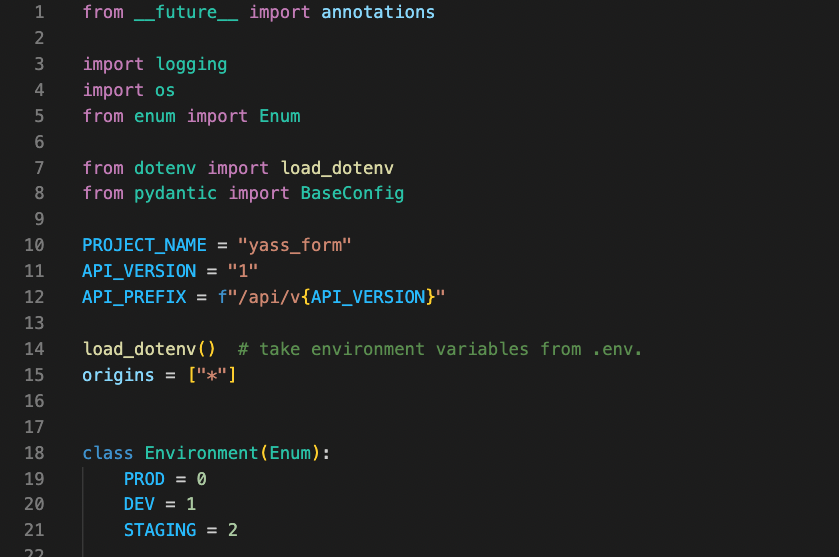

# Visual Studio Code

En pasos previos, vimos como descargar el editor de texto visual studio code (vs code para los amigos).
Esta es una potente herramienta que nos ayudará a desarrollar con más facilidad las actividades de un programador,
como reiteradas veces dijimos no es necesario ningún programa especial para poder programar ... pero ayuda tener la
herramienta que nos haga el trabajo más fácil.

Ahora bien, por si solo, vscode no ofrece mucha ayuda. Dado que fue pensado de forma modular, el editor viene con poca funcionalidad y debemos descargar los plugins correctos para facilitarnos el trabajo.

En esta sección veremos cuales son algunos de estos plugins y como configurarlos para nuestra preferencia...

## Python & Pylance (Language servers):
Los primeros 2 `plug-ins` que veremos son parte de lo que se denomina `language server`. Son pequeños programas que 
corren en un segundo plano y nos ayudan interpretando lo que escribimos en el editor. Son los encargados de mostrarnos
que algún nombre pertence a las palabras reservadas de Python o nos muestran con *highlights* la estructura 
de nuestro código (a.k.a los colores lindos en el editor del profe).

Para obtener dicho resultado seguiremos los siguientes pasos:

1. Abrir vscode.
2. En la barra lateral ubicar la opción de `extensiones` y clickear.
3. En la barra de búsqueda escribir: `Python` y seleccionar el primer resultado.
En este punto deberiamos ver la página principal del plugin:

4. Hacemos click sobre install (en el caso de la imagen dice `uninstall` por ya estar instalado).
5. Nuevamente, vamos a la barra de búsqueda en `extensiones` y buscamos por `Pylance`
6. Nuevamente descargamos la opción siguiente:

Ahora si, nos encontramos con un editor listo para trabajar en proyectos relacionados con Python.